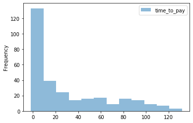

## Conversion funnel for part 4


## Jupyter notebook for data exploration

```python
from tabulate import tabulate
import pandas as pd, csv, sqlite3
conn = sqlite3.connect('mra.db')
c = conn.cursor()
```


```python
#parse csv's
accounts = pd.read_csv('accounts.csv', sep = ',', header=0)
accounts.to_sql('accounts', conn, if_exists='replace', index = False)
click_upgrade = pd.read_csv('click_upgrade.csv', sep = ',', header=0)
click_upgrade.to_sql('click_upgrade', conn, if_exists='replace', index = False)
clicked_locked_feature = pd.read_csv('clicked_locked_feature.csv', sep = ',', header=0)
clicked_locked_feature.to_sql('clicked_locked_feature', conn, if_exists='replace', index = False)
show_inapp_pricing = pd.read_csv('show_inapp_pricing.csv', sep = ',', header=0)
show_inapp_pricing.to_sql('show_inapp_pricing', conn, if_exists='replace', index = False)
viewed_payment_details = pd.read_csv('viewed_payment_details.csv', sep = ',', header=0)
viewed_payment_details.to_sql('viewed_payment_details', conn, if_exists='replace', index = False)
subscription_created = pd.read_csv('subscription_created.csv', sep = ',', header=0)
subscription_created.to_sql('subscription_created', conn, if_exists='replace', index = False)
```


```python
#check pandas tables and type detection from DDLs
df = pd.read_sql("""select *
from sqlite_master""", conn)
print(tabulate(df, headers = 'keys', tablefmt = 'psql'))
```

    +----+--------+------------------------+------------------------+------------+-----------------------------------------+
    |    | type   | name                   | tbl_name               |   rootpage | sql                                     |
    |----+--------+------------------------+------------------------+------------+-----------------------------------------|
    |  0 | table  | accounts               | accounts               |          2 | CREATE TABLE "accounts" (               |
    |    |        |                        |                        |            | "account_id" INTEGER,                   |
    |    |        |                        |                        |            |   "created_at" TEXT,                    |
    |    |        |                        |                        |            |   "creator_id" INTEGER,                 |
    |    |        |                        |                        |            |   "members" INTEGER,                    |
    |    |        |                        |                        |            |   "company_size" TEXT,                  |
    |    |        |                        |                        |            |   "status" TEXT,                        |
    |    |        |                        |                        |            |   "first_plan" TEXT,                    |
    |    |        |                        |                        |            |   "last_plan" TEXT,                     |
    |    |        |                        |                        |            |   "first_date_mrr" TEXT,                |
    |    |        |                        |                        |            |   "last_date_mrr" TEXT,                 |
    |    |        |                        |                        |            |   "seats" REAL                          |
    |    |        |                        |                        |            | )                                       |
    |  1 | table  | click_upgrade          | click_upgrade          |       1030 | CREATE TABLE "click_upgrade" (          |
    |    |        |                        |                        |            | "user_id" INTEGER,                      |
    |    |        |                        |                        |            |   "time" TEXT,                          |
    |    |        |                        |                        |            |   "click_upgrade_from" TEXT             |
    |    |        |                        |                        |            | )                                       |
    |  2 | table  | clicked_locked_feature | clicked_locked_feature |       1022 | CREATE TABLE "clicked_locked_feature" ( |
    |    |        |                        |                        |            | "user_id" INTEGER,                      |
    |    |        |                        |                        |            |   "time" TEXT,                          |
    |    |        |                        |                        |            |   "locked_feature_name" TEXT            |
    |    |        |                        |                        |            | )                                       |
    |  3 | table  | show_inapp_pricing     | show_inapp_pricing     |        939 | CREATE TABLE "show_inapp_pricing" (     |
    |    |        |                        |                        |            | "user_id" INTEGER,                      |
    |    |        |                        |                        |            |   "time" TEXT                           |
    |    |        |                        |                        |            | )                                       |
    |  4 | table  | viewed_payment_details | viewed_payment_details |       1024 | CREATE TABLE "viewed_payment_details" ( |
    |    |        |                        |                        |            | "user_id" INTEGER,                      |
    |    |        |                        |                        |            |   "time" TEXT                           |
    |    |        |                        |                        |            | )                                       |
    |  5 | table  | subscription_created   | subscription_created   |       1026 | CREATE TABLE "subscription_created" (   |
    |    |        |                        |                        |            | "time" TEXT,                            |
    |    |        |                        |                        |            |   "user_id" INTEGER                     |
    |    |        |                        |                        |            | )                                       |
    +----+--------+------------------------+------------------------+------------+-----------------------------------------+


```python
#hacky workaround to handle timestamp with timezone in sqlite
pd.read_sql("""SELECT date(replace(time, ' UTC', '')) as date_day, 
time, user_id 
FROM subscription_created limit 2""", conn)
```


<div>
<style scoped>
    .dataframe tbody tr th:only-of-type {
        vertical-align: middle;
    }

    .dataframe tbody tr th {
        vertical-align: top;
    }

    .dataframe thead th {
        text-align: right;
    }
</style>
<table border="1" class="dataframe">
  <thead>
    <tr style="text-align: right;">
      <th></th>
      <th>date_day</th>
      <th>time</th>
      <th>user_id</th>
    </tr>
  </thead>
  <tbody>
    <tr>
      <td>0</td>
      <td>2019-02-14</td>
      <td>2019-02-14 15:03:29 UTC</td>
      <td>3074457346455127815</td>
    </tr>
    <tr>
      <td>1</td>
      <td>2019-02-08</td>
      <td>2019-02-08 12:48:46 UTC</td>
      <td>3074457346439303468</td>
    </tr>
    <tr>
      <td>2</td>
      <td>2019-02-07</td>
      <td>2019-02-07 03:10:32 UTC</td>
      <td>3074457346437894997</td>
    </tr>
    <tr>
      <td>3</td>
      <td>2019-04-01</td>
      <td>2019-04-01 12:47:04 UTC</td>
      <td>3074457346454749213</td>
    </tr>
    <tr>
      <td>4</td>
      <td>2019-04-25</td>
      <td>2019-04-25 08:54:13 UTC</td>
      <td>3074457346440595468</td>
    </tr>
  </tbody>
</table>
</div>


```python
#Slide 1

#checking out how long it takes users to convert from creating an account 
#> to getting a paid subscription

##data error? some accounts were paid for even before they were created
pd.read_sql("""
select *
from (
SELECT 
creator_id,
status,
datetime(replace(created_at, ' UTC', '')) as a_create,
datetime(replace(first_date_mrr, ' UTC', '')) as a_paid,
julianday(replace(first_date_mrr, ' UTC', '')) - julianday(replace(created_at, ' UTC', ''))
as time_to_pay
FROM accounts
where status is not null)
where time_to_pay < 0
""", conn)
```


<div>
<style scoped>
    .dataframe tbody tr th:only-of-type {
        vertical-align: middle;
    }

    .dataframe tbody tr th {
        vertical-align: top;
    }

    .dataframe thead th {
        text-align: right;
    }
</style>
<table border="1" class="dataframe">
  <thead>
    <tr style="text-align: right;">
      <th></th>
      <th>creator_id</th>
      <th>status</th>
      <th>a_create</th>
      <th>a_paid</th>
      <th>time_to_pay</th>
    </tr>
  </thead>
  <tbody>
    <tr>
      <td>0</td>
      <td>3074457345909571854</td>
      <td>active</td>
      <td>2019-02-10 06:44:28</td>
      <td>2019-02-10 06:38:43</td>
      <td>-0.003993</td>
    </tr>
    <tr>
      <td>1</td>
      <td>3074457346418774038</td>
      <td>active</td>
      <td>2019-02-20 14:49:49</td>
      <td>2019-02-20 14:44:04</td>
      <td>-0.003993</td>
    </tr>
    <tr>
      <td>2</td>
      <td>87516324</td>
      <td>active</td>
      <td>2019-02-14 19:08:22</td>
      <td>2019-02-13 18:16:12</td>
      <td>-1.036227</td>
    </tr>
    <tr>
      <td>3</td>
      <td>3074457345962810102</td>
      <td>expired</td>
      <td>2019-02-21 22:33:44</td>
      <td>2019-02-21 22:33:40</td>
      <td>-0.000046</td>
    </tr>
    <tr>
      <td>4</td>
      <td>3074457346315105601</td>
      <td>expired</td>
      <td>2019-02-19 10:51:41</td>
      <td>2019-02-19 10:51:38</td>
      <td>-0.000035</td>
    </tr>
    <tr>
      <td>5</td>
      <td>3074457346409260371</td>
      <td>active</td>
      <td>2019-02-28 17:18:24</td>
      <td>2019-02-26 22:54:35</td>
      <td>-1.766539</td>
    </tr>
    <tr>
      <td>6</td>
      <td>3074457346101775739</td>
      <td>active</td>
      <td>2019-02-14 18:02:03</td>
      <td>2019-02-14 17:57:35</td>
      <td>-0.003102</td>
    </tr>
    <tr>
      <td>7</td>
      <td>3074457345863477252</td>
      <td>active</td>
      <td>2019-02-21 10:54:42</td>
      <td>2019-02-21 10:49:39</td>
      <td>-0.003507</td>
    </tr>
    <tr>
      <td>8</td>
      <td>3074457346463235200</td>
      <td>active</td>
      <td>2019-02-19 14:53:51</td>
      <td>2019-02-19 12:09:39</td>
      <td>-0.114028</td>
    </tr>
    <tr>
      <td>9</td>
      <td>3074457346058817184</td>
      <td>expired</td>
      <td>2019-02-14 04:25:54</td>
      <td>2019-02-14 04:03:53</td>
      <td>-0.015289</td>
    </tr>
    <tr>
      <td>10</td>
      <td>3074457346451346518</td>
      <td>active</td>
      <td>2019-02-13 17:07:45</td>
      <td>2019-02-13 17:07:42</td>
      <td>-0.000035</td>
    </tr>
    <tr>
      <td>11</td>
      <td>3074457346474082255</td>
      <td>expired</td>
      <td>2019-02-25 04:05:43</td>
      <td>2019-02-25 04:05:41</td>
      <td>-0.000023</td>
    </tr>
    <tr>
      <td>12</td>
      <td>3074457346410562318</td>
      <td>expired</td>
      <td>2019-02-27 07:03:03</td>
      <td>2019-02-27 07:02:59</td>
      <td>-0.000046</td>
    </tr>
    <tr>
      <td>13</td>
      <td>100636176</td>
      <td>expired</td>
      <td>2019-02-19 07:08:07</td>
      <td>2019-02-19 07:08:03</td>
      <td>-0.000046</td>
    </tr>
    <tr>
      <td>14</td>
      <td>3074457346241834657</td>
      <td>active</td>
      <td>2019-02-25 23:37:49</td>
      <td>2019-02-25 22:49:32</td>
      <td>-0.033530</td>
    </tr>
    <tr>
      <td>15</td>
      <td>3074457346302496107</td>
      <td>active</td>
      <td>2019-02-18 12:46:29</td>
      <td>2019-02-18 12:46:26</td>
      <td>-0.000035</td>
    </tr>
    <tr>
      <td>16</td>
      <td>3074457346448426024</td>
      <td>active</td>
      <td>2019-02-11 17:25:10</td>
      <td>2019-02-11 17:25:08</td>
      <td>-0.000023</td>
    </tr>
    <tr>
      <td>17</td>
      <td>295662</td>
      <td>active</td>
      <td>2019-02-05 08:56:02</td>
      <td>2019-02-05 08:55:58</td>
      <td>-0.000046</td>
    </tr>
    <tr>
      <td>18</td>
      <td>3074457346414815063</td>
      <td>active</td>
      <td>2019-02-13 14:56:06</td>
      <td>2019-02-13 14:56:03</td>
      <td>-0.000035</td>
    </tr>
    <tr>
      <td>19</td>
      <td>3074457345854281875</td>
      <td>active</td>
      <td>2019-02-08 15:49:06</td>
      <td>2019-02-08 15:49:04</td>
      <td>-0.000023</td>
    </tr>
    <tr>
      <td>20</td>
      <td>3074457346176242710</td>
      <td>active</td>
      <td>2019-02-22 21:41:34</td>
      <td>2019-02-22 21:41:31</td>
      <td>-0.000035</td>
    </tr>
    <tr>
      <td>21</td>
      <td>3074457346457926128</td>
      <td>active</td>
      <td>2019-02-15 20:44:23</td>
      <td>2019-02-15 20:44:21</td>
      <td>-0.000023</td>
    </tr>
    <tr>
      <td>22</td>
      <td>3074457346453361269</td>
      <td>active</td>
      <td>2019-02-20 23:29:30</td>
      <td>2019-02-20 23:29:27</td>
      <td>-0.000035</td>
    </tr>
    <tr>
      <td>23</td>
      <td>3074457346307875351</td>
      <td>active</td>
      <td>2019-02-05 09:40:44</td>
      <td>2019-02-05 09:40:40</td>
      <td>-0.000046</td>
    </tr>
  </tbody>
</table>
</div>


```python
#find average user time taken to convert to paid from account creation
pd.read_sql("""
SELECT 
avg(julianday(replace(first_date_mrr, ' UTC', '')) - julianday(replace(created_at, ' UTC', '')))
as time_to_pay_avg
FROM accounts
where status is not null
""", conn)
```


<div>
<style scoped>
    .dataframe tbody tr th:only-of-type {
        vertical-align: middle;
    }

    .dataframe tbody tr th {
        vertical-align: top;
    }

    .dataframe thead th {
        text-align: right;
    }
</style>
<table border="1" class="dataframe">
  <thead>
    <tr style="text-align: right;">
      <th></th>
      <th>time_to_pay_avg</th>
    </tr>
  </thead>
  <tbody>
    <tr>
      <td>0</td>
      <td>30.430774</td>
    </tr>
  </tbody>
</table>
</div>


```python
#find user time to account creation and check distribution
df = pd.read_sql("""
SELECT 
julianday(replace(first_date_mrr, ' UTC', '')) - julianday(replace(created_at, ' UTC', ''))
as time_to_pay
FROM accounts
where status is not null
""", conn)
ax = df.plot.hist(bins=12, alpha=0.5)
```





```python
#Slide 2

#Build funnel to track users through story points (overall conversion - no prompts)
#accounts > upgrade click > view pricing > payment details > complete sub
pd.read_sql("""
select
count(distinct creator_id) as all_users,
count(distinct cu.user_id) as clicked_upgrade,
count(distinct sp.user_id) as viewed_pricing,
count(distinct vd.user_id) as payment_details,
count(distinct sc.user_id) as subscribers,
count(distinct case when status is not null then account_id end) as subscribing_teams

from accounts a 
left join click_upgrade cu 
    on cu.user_id = creator_id
left join show_inapp_pricing sp    
    on sp.user_id = creator_id
left join viewed_payment_details vd 
    on vd.user_id = creator_id
left join subscription_created sc
    on a.creator_id = sc.user_id 
""", conn)
```


<div>
<style scoped>
    .dataframe tbody tr th:only-of-type {
        vertical-align: middle;
    }

    .dataframe tbody tr th {
        vertical-align: top;
    }

    .dataframe thead th {
        text-align: right;
    }
</style>
<table border="1" class="dataframe">
  <thead>
    <tr style="text-align: right;">
      <th></th>
      <th>all_users</th>
      <th>clicked_upgrade</th>
      <th>viewed_pricing</th>
      <th>payment_details</th>
      <th>subscribers</th>
      <th>subscribing_teams</th>
    </tr>
  </thead>
  <tbody>
    <tr>
      <td>0</td>
      <td>50130</td>
      <td>6724</td>
      <td>6385</td>
      <td>1258</td>
      <td>301</td>
      <td>301</td>
    </tr>
  </tbody>
</table>
</div>


```python
#Slide 3 - initial data exploration
# check out most popular subscription touchpoints and prompts
df =  pd.read_sql("""
select 
locked_feature_name,
(sum(ct) OVER(partition by locked_feature_name)) * 1.0/ total as locked_feature_perc,
click_upgrade_from,
ct as clicks,
(ct * 1.0 /total) as ratio_to_report
from (
select
locked_feature_name,
click_upgrade_from,
count(*) as ct,
sum(count(*)) OVER() AS total
from accounts a
left join clicked_locked_feature cl
    on cl.user_id = creator_id
left join click_upgrade cu 
    on cu.user_id = creator_id
where status is not null
group by 1, 2)
order by 1, 3 desc, 2
""", conn)
#df.to_clipboard(sep=',')
print(tabulate(df, headers = 'keys', tablefmt = 'psql'))
```

    +-----+------------------------------+-----------------------+--------------------------------+----------+-------------------+
    |     | locked_feature_name          |   locked_feature_perc | click_upgrade_from             |   clicks |   ratio_to_report |
    |-----+------------------------------+-----------------------+--------------------------------+----------+-------------------|
    |   0 |                              |             0.0284453 | team_paused_banner_dashboard   |        7 |       0.00114435  |
    |   1 |                              |             0.0284453 | sharing_dialog                 |        2 |       0.000326958 |
    |   2 |                              |             0.0284453 | shareable_link                 |        3 |       0.000490436 |
    |   3 |                              |             0.0284453 | hi_res_export                  |       41 |       0.00670263  |
    |   4 |                              |             0.0284453 | dashboard_toolbar              |       80 |       0.0130783   |
    |   5 |                              |             0.0284453 | dashboard menu                 |       34 |       0.00555828  |
    |   6 |                              |             0.0284453 | create_project                 |        2 |       0.000326958 |
    |   7 |                              |             0.0284453 | Features_popup                 |        1 |       0.000163479 |
    |   8 |                              |             0.0284453 | Board cannot be created        |        4 |       0.000653915 |
    |   9 | Private_board_popup          |             0.124407  | team_paused_banner_dashboard   |       13 |       0.00212522  |
    |  10 | Private_board_popup          |             0.124407  | sharing_dialog                 |       11 |       0.00179827  |
    |  11 | Private_board_popup          |             0.124407  | shareable_link                 |        8 |       0.00130783  |
    |  12 | Private_board_popup          |             0.124407  | settings_non-team_users        |        2 |       0.000326958 |
    |  13 | Private_board_popup          |             0.124407  | over_boards_limit_popup        |       20 |       0.00326958  |
    |  14 | Private_board_popup          |             0.124407  | over_boards_limit_banner_board |       11 |       0.00179827  |
    |  15 | Private_board_popup          |             0.124407  | over_boards_limit_banner       |       19 |       0.0031061   |
    |  16 | Private_board_popup          |             0.124407  | jira_addon                     |        6 |       0.000980873 |
    |  17 | Private_board_popup          |             0.124407  | hi_res_export                  |       50 |       0.00817394  |
    |  18 | Private_board_popup          |             0.124407  | dashboard_toolbar              |      437 |       0.0714402   |
    |  19 | Private_board_popup          |             0.124407  | dashboard_invite_window        |        5 |       0.000817394 |
    |  20 | Private_board_popup          |             0.124407  | dashboard menu                 |       65 |       0.0106261   |
    |  21 | Private_board_popup          |             0.124407  | custom_template_tip            |        5 |       0.000817394 |
    |  22 | Private_board_popup          |             0.124407  | create_template_board          |        7 |       0.00114435  |
    |  23 | Private_board_popup          |             0.124407  | create_template                |        4 |       0.000653915 |
    |  24 | Private_board_popup          |             0.124407  | create_teamplate_widget        |        2 |       0.000326958 |
    |  25 | Private_board_popup          |             0.124407  | create_project                 |       25 |       0.00408697  |
    |  26 | Private_board_popup          |             0.124407  | backup_board                   |       17 |       0.00277914  |
    |  27 | Private_board_popup          |             0.124407  | Private_board_popup            |       16 |       0.00261566  |
    |  28 | Private_board_popup          |             0.124407  | Features_popup                 |       37 |       0.00604872  |
    |  29 | Private_board_popup          |             0.124407  | Board cannot be created        |        1 |       0.000163479 |
    |  30 | backup_board                 |             0.105444  | team_paused_banner_dashboard   |       18 |       0.00294262  |
    |  31 | backup_board                 |             0.105444  | shareable_link                 |        2 |       0.000326958 |
    |  32 | backup_board                 |             0.105444  | over_boards_limit_popup        |       11 |       0.00179827  |
    |  33 | backup_board                 |             0.105444  | over_boards_limit_banner_board |        4 |       0.000653915 |
    |  34 | backup_board                 |             0.105444  | over_boards_limit_banner       |        9 |       0.00147131  |
    |  35 | backup_board                 |             0.105444  | jira_addon                     |        3 |       0.000490436 |
    |  36 | backup_board                 |             0.105444  | hi_res_export                  |       31 |       0.00506784  |
    |  37 | backup_board                 |             0.105444  | dashboard_toolbar              |      251 |       0.0410332   |
    |  38 | backup_board                 |             0.105444  | dashboard_invite_window        |        1 |       0.000163479 |
    |  39 | backup_board                 |             0.105444  | dashboard menu                 |       70 |       0.0114435   |
    |  40 | backup_board                 |             0.105444  | custom_template_tip            |        2 |       0.000326958 |
    |  41 | backup_board                 |             0.105444  | create_template_board          |        9 |       0.00147131  |
    |  42 | backup_board                 |             0.105444  | create_template                |        1 |       0.000163479 |
    |  43 | backup_board                 |             0.105444  | create_teamplate_widget        |        1 |       0.000163479 |
    |  44 | backup_board                 |             0.105444  | create_project                 |       14 |       0.0022887   |
    |  45 | backup_board                 |             0.105444  | backup_board                   |      176 |       0.0287723   |
    |  46 | backup_board                 |             0.105444  | Private_board_popup            |        4 |       0.000653915 |
    |  47 | backup_board                 |             0.105444  | Features_popup                 |       37 |       0.00604872  |
    |  48 | backup_board                 |             0.105444  | Board cannot be created        |        1 |       0.000163479 |
    |  49 | create_project               |             0.191924  | team_paused_banner_dashboard   |       47 |       0.0076835   |
    |  50 | create_project               |             0.191924  | sharing_dialog                 |       15 |       0.00245218  |
    |  51 | create_project               |             0.191924  | shareable_link                 |        2 |       0.000326958 |
    |  52 | create_project               |             0.191924  | settings_non-team_users        |        2 |       0.000326958 |
    |  53 | create_project               |             0.191924  | private_board_locked           |        1 |       0.000163479 |
    |  54 | create_project               |             0.191924  | over_boards_limit_popup        |       32 |       0.00523132  |
    |  55 | create_project               |             0.191924  | over_boards_limit_banner_board |       18 |       0.00294262  |
    |  56 | create_project               |             0.191924  | over_boards_limit_banner       |       28 |       0.00457741  |
    |  57 | create_project               |             0.191924  | jira_addon                     |        2 |       0.000326958 |
    |  58 | create_project               |             0.191924  | hi_res_export                  |       55 |       0.00899134  |
    |  59 | create_project               |             0.191924  | dashboard_toolbar              |      678 |       0.110839    |
    |  60 | create_project               |             0.191924  | dashboard_invite_window        |        4 |       0.000653915 |
    |  61 | create_project               |             0.191924  | dashboard menu                 |      123 |       0.0201079   |
    |  62 | create_project               |             0.191924  | custom_template_tip            |       12 |       0.00196175  |
    |  63 | create_project               |             0.191924  | create_template_board          |        5 |       0.000817394 |
    |  64 | create_project               |             0.191924  | create_template                |        1 |       0.000163479 |
    |  65 | create_project               |             0.191924  | create_project                 |       76 |       0.0124244   |
    |  66 | create_project               |             0.191924  | backup_board                   |       21 |       0.00343306  |
    |  67 | create_project               |             0.191924  | Private_board_popup            |       10 |       0.00163479  |
    |  68 | create_project               |             0.191924  | Features_popup                 |       42 |       0.00686611  |
    |  69 | create_teamplate_widget      |             0.0305705 | team_paused_banner_dashboard   |        3 |       0.000490436 |
    |  70 | create_teamplate_widget      |             0.0305705 | sharing_dialog                 |        1 |       0.000163479 |
    |  71 | create_teamplate_widget      |             0.0305705 | shareable_link                 |        2 |       0.000326958 |
    |  72 | create_teamplate_widget      |             0.0305705 | over_boards_limit_banner_board |        5 |       0.000817394 |
    |  73 | create_teamplate_widget      |             0.0305705 | over_boards_limit_banner       |       15 |       0.00245218  |
    |  74 | create_teamplate_widget      |             0.0305705 | hi_res_export                  |        4 |       0.000653915 |
    |  75 | create_teamplate_widget      |             0.0305705 | dashboard_toolbar              |      106 |       0.0173288   |
    |  76 | create_teamplate_widget      |             0.0305705 | dashboard menu                 |       17 |       0.00277914  |
    |  77 | create_teamplate_widget      |             0.0305705 | create_template_board          |        4 |       0.000653915 |
    |  78 | create_teamplate_widget      |             0.0305705 | create_template                |        6 |       0.000980873 |
    |  79 | create_teamplate_widget      |             0.0305705 | create_teamplate_widget        |        7 |       0.00114435  |
    |  80 | create_teamplate_widget      |             0.0305705 | backup_board                   |        1 |       0.000163479 |
    |  81 | create_teamplate_widget      |             0.0305705 | Private_board_popup            |        1 |       0.000163479 |
    |  82 | create_teamplate_widget      |             0.0305705 | Features_popup                 |       15 |       0.00245218  |
    |  83 | create_template_board        |             0.0189635 | shareable_link                 |        3 |       0.000490436 |
    |  84 | create_template_board        |             0.0189635 | over_boards_limit_popup        |        5 |       0.000817394 |
    |  85 | create_template_board        |             0.0189635 | over_boards_limit_banner       |        2 |       0.000326958 |
    |  86 | create_template_board        |             0.0189635 | hi_res_export                  |       12 |       0.00196175  |
    |  87 | create_template_board        |             0.0189635 | dashboard_toolbar              |       59 |       0.00964525  |
    |  88 | create_template_board        |             0.0189635 | dashboard menu                 |        7 |       0.00114435  |
    |  89 | create_template_board        |             0.0189635 | custom_template_tip            |        1 |       0.000163479 |
    |  90 | create_template_board        |             0.0189635 | create_template_board          |       14 |       0.0022887   |
    |  91 | create_template_board        |             0.0189635 | create_template                |        1 |       0.000163479 |
    |  92 | create_template_board        |             0.0189635 | create_project                 |        1 |       0.000163479 |
    |  93 | create_template_board        |             0.0189635 | backup_board                   |        4 |       0.000653915 |
    |  94 | create_template_board        |             0.0189635 | Private_board_popup            |        2 |       0.000326958 |
    |  95 | create_template_board        |             0.0189635 | Features_popup                 |        5 |       0.000817394 |
    |  96 | custom_template_personal     |             0.0805951 | team_paused_banner_dashboard   |        7 |       0.00114435  |
    |  97 | custom_template_personal     |             0.0805951 | sharing_dialog                 |        1 |       0.000163479 |
    |  98 | custom_template_personal     |             0.0805951 | shareable_link                 |        1 |       0.000163479 |
    |  99 | custom_template_personal     |             0.0805951 | settings_non-team_users        |        2 |       0.000326958 |
    | 100 | custom_template_personal     |             0.0805951 | over_boards_limit_popup        |        7 |       0.00114435  |
    | 101 | custom_template_personal     |             0.0805951 | over_boards_limit_banner       |        8 |       0.00130783  |
    | 102 | custom_template_personal     |             0.0805951 | jira_addon                     |        4 |       0.000653915 |
    | 103 | custom_template_personal     |             0.0805951 | hi_res_export                  |       34 |       0.00555828  |
    | 104 | custom_template_personal     |             0.0805951 | dashboard_toolbar              |      337 |       0.0550924   |
    | 105 | custom_template_personal     |             0.0805951 | dashboard_invite_window        |        2 |       0.000326958 |
    | 106 | custom_template_personal     |             0.0805951 | dashboard menu                 |       43 |       0.00702959  |
    | 107 | custom_template_personal     |             0.0805951 | custom_template_tip            |        2 |       0.000326958 |
    | 108 | custom_template_personal     |             0.0805951 | create_template_board          |        6 |       0.000980873 |
    | 109 | custom_template_personal     |             0.0805951 | create_template                |        4 |       0.000653915 |
    | 110 | custom_template_personal     |             0.0805951 | create_teamplate_widget        |        2 |       0.000326958 |
    | 111 | custom_template_personal     |             0.0805951 | create_project                 |        6 |       0.000980873 |
    | 112 | custom_template_personal     |             0.0805951 | Private_board_popup            |        5 |       0.000817394 |
    | 113 | custom_template_personal     |             0.0805951 | Features_popup                 |       22 |       0.00359653  |
    | 114 | custom_template_team         |             0.0353114 | team_paused_banner_dashboard   |        1 |       0.000163479 |
    | 115 | custom_template_team         |             0.0353114 | shareable_link                 |        1 |       0.000163479 |
    | 116 | custom_template_team         |             0.0353114 | over_boards_limit_popup        |        5 |       0.000817394 |
    | 117 | custom_template_team         |             0.0353114 | over_boards_limit_banner       |        4 |       0.000653915 |
    | 118 | custom_template_team         |             0.0353114 | hi_res_export                  |       16 |       0.00261566  |
    | 119 | custom_template_team         |             0.0353114 | dashboard_toolbar              |      153 |       0.0250123   |
    | 120 | custom_template_team         |             0.0353114 | dashboard menu                 |       11 |       0.00179827  |
    | 121 | custom_template_team         |             0.0353114 | custom_template_tip            |        1 |       0.000163479 |
    | 122 | custom_template_team         |             0.0353114 | create_template_board          |        4 |       0.000653915 |
    | 123 | custom_template_team         |             0.0353114 | create_template                |        4 |       0.000653915 |
    | 124 | custom_template_team         |             0.0353114 | create_teamplate_widget        |        1 |       0.000163479 |
    | 125 | custom_template_team         |             0.0353114 | create_project                 |        3 |       0.000490436 |
    | 126 | custom_template_team         |             0.0353114 | Features_popup                 |       12 |       0.00196175  |
    | 127 | custom_template_tip          |             0.0120974 | private_board_locked           |        2 |       0.000326958 |
    | 128 | custom_template_tip          |             0.0120974 | over_boards_limit_banner       |        2 |       0.000326958 |
    | 129 | custom_template_tip          |             0.0120974 | dashboard_toolbar              |       34 |       0.00555828  |
    | 130 | custom_template_tip          |             0.0120974 | dashboard_invite_window        |        4 |       0.000653915 |
    | 131 | custom_template_tip          |             0.0120974 | dashboard menu                 |        7 |       0.00114435  |
    | 132 | custom_template_tip          |             0.0120974 | custom_template_tip            |       15 |       0.00245218  |
    | 133 | custom_template_tip          |             0.0120974 | create_template_board          |        1 |       0.000163479 |
    | 134 | custom_template_tip          |             0.0120974 | create_template                |        1 |       0.000163479 |
    | 135 | custom_template_tip          |             0.0120974 | create_project                 |        1 |       0.000163479 |
    | 136 | custom_template_tip          |             0.0120974 | Private_board_popup            |        2 |       0.000326958 |
    | 137 | custom_template_tip          |             0.0120974 | Features_popup                 |        5 |       0.000817394 |
    | 138 | jira_addon                   |             0.0145496 | sharing_dialog                 |        1 |       0.000163479 |
    | 139 | jira_addon                   |             0.0145496 | over_boards_limit_popup        |        1 |       0.000163479 |
    | 140 | jira_addon                   |             0.0145496 | jira_addon                     |       13 |       0.00212522  |
    | 141 | jira_addon                   |             0.0145496 | hi_res_export                  |        6 |       0.000980873 |
    | 142 | jira_addon                   |             0.0145496 | dashboard_toolbar              |       56 |       0.00915481  |
    | 143 | jira_addon                   |             0.0145496 | dashboard menu                 |        4 |       0.000653915 |
    | 144 | jira_addon                   |             0.0145496 | create_template_board          |        1 |       0.000163479 |
    | 145 | jira_addon                   |             0.0145496 | create_project                 |        2 |       0.000326958 |
    | 146 | jira_addon                   |             0.0145496 | Features_popup                 |        5 |       0.000817394 |
    | 147 | show_over_boards_limit_popup |             0.357692  | team_paused_banner_dashboard   |      119 |       0.019454    |
    | 148 | show_over_boards_limit_popup |             0.357692  | sharing_dialog                 |       10 |       0.00163479  |
    | 149 | show_over_boards_limit_popup |             0.357692  | shareable_link                 |       15 |       0.00245218  |
    | 150 | show_over_boards_limit_popup |             0.357692  | over_boards_limit_popup        |      126 |       0.0205983   |
    | 151 | show_over_boards_limit_popup |             0.357692  | over_boards_limit_banner_board |       31 |       0.00506784  |
    | 152 | show_over_boards_limit_popup |             0.357692  | over_boards_limit_banner       |       76 |       0.0124244   |
    | 153 | show_over_boards_limit_popup |             0.357692  | jira_addon                     |        4 |       0.000653915 |
    | 154 | show_over_boards_limit_popup |             0.357692  | hi_res_export                  |       74 |       0.0120974   |
    | 155 | show_over_boards_limit_popup |             0.357692  | dashboard_toolbar              |     1379 |       0.225437    |
    | 156 | show_over_boards_limit_popup |             0.357692  | dashboard_invite_window        |       21 |       0.00343306  |
    | 157 | show_over_boards_limit_popup |             0.357692  | dashboard menu                 |      203 |       0.0331862   |
    | 158 | show_over_boards_limit_popup |             0.357692  | custom_template_tip            |       10 |       0.00163479  |
    | 159 | show_over_boards_limit_popup |             0.357692  | create_template_board          |       20 |       0.00326958  |
    | 160 | show_over_boards_limit_popup |             0.357692  | create_template                |        1 |       0.000163479 |
    | 161 | show_over_boards_limit_popup |             0.357692  | create_project                 |       28 |       0.00457741  |
    | 162 | show_over_boards_limit_popup |             0.357692  | backup_board                   |       10 |       0.00163479  |
    | 163 | show_over_boards_limit_popup |             0.357692  | Private_board_popup            |       15 |       0.00245218  |
    | 164 | show_over_boards_limit_popup |             0.357692  | Features_popup                 |       45 |       0.00735655  |
    | 165 | show_over_boards_limit_popup |             0.357692  | Board cannot be created        |        1 |       0.000163479 |
    +-----+------------------------------+-----------------------+--------------------------------+----------+-------------------+


```python
#Slide 3

#find most popular sources for upgrade clicks

df = pd.read_sql("""
select
click_upgrade_from,
Count(*) as ct
from click_upgrade
group by 1
""", conn)
df.to_clipboard(sep=',')
print(df)
```

                     click_upgrade_from    ct
    0                              None    11
    1           Board cannot be created    40
    2                    Features_popup   766
    3               Private_board_popup   628
    4                      backup_board   715
    5   board_locked_by_limits_exceeded     4
    6                    create_project   939
    7           create_teamplate_widget   143
    8                   create_template   351
    9             create_template_board   533
    10              custom_template_tip   246
    11                   dashboard menu   682
    12          dashboard_invite_window    75
    13                dashboard_toolbar  4528
    14                    hi_res_export  1097
    15                       jira_addon    78
    16         over_boards_limit_banner   134
    17   over_boards_limit_banner_board   195
    18          over_boards_limit_popup   652
    19             private_board_locked    20
    20          settings_non-team_users     7
    21        settings_sharing_settings     5
    22                   shareable_link   189
    23                   sharing_dialog   115
    24     team_paused_banner_dashboard    72
    25            team_settings_billing     3


```python
#find most popular hit for locked feature prompts

#note: the 'high res export' feature is missing from here, even though it is a 
#button instead of a modal prompt, but it should probably be included in this table

df = pd.read_sql("""
select
locked_feature_name,
Count(*) as ct
from clicked_locked_feature
group by 1
""", conn)
df.to_clipboard(sep=',')
print(df)
```

                locked_feature_name     ct
    0           Private_board_popup  11604
    1                  backup_board   3983
    2                create_project   7055
    3       create_teamplate_widget   1097
    4         create_template_board   2270
    5      custom_template_personal   6055
    6          custom_template_team   2555
    7           custom_template_tip    246
    8                    jira_addon    541
    9  show_over_boards_limit_popup  11859


```python
#get total locked feature + upgrade clicks

df = pd.read_sql("""
select
'locked_features' as n,
Count(*) as ct
from clicked_locked_feature
group by 1
union all
select
'upgrade clicks' as n,
count(*) as ct
from click_upgrade
group by 1
""", conn)
df.to_clipboard(sep=',')
print(df)
```

                     n     ct
    0  locked_features  47265
    1   upgrade clicks  12228


```python
#Slide 4
#Build conversion funnel based on events (not users this time) 

#using time based joins and user/time stamps to reduce duplicate user flows
#looks like many users navigate to payment details and then go back to the pricing page

#note: null events in click_upgrade table show some tracking bug most likely 
#(probably no.js, adblock or interrupted sessions)

df = pd.read_sql("""
select

cu.click_upgrade_from,
count(distinct cu.user_id || cu.time ) as upgrade_clicks,
count(distinct sp.user_id || sp.time ) as pricing_clicks,
count(distinct vd.user_id || vd.time ) as payment_details,
count(distinct sc.user_id || sc.time ) as subscribers

from accounts a 
left join click_upgrade cu 
    on cu.user_id = creator_id
left join show_inapp_pricing sp    
    on sp.user_id = cu.user_id
    and replace(sp.time, ' UTC', '') 
        between replace(cu.time, ' UTC', '')
        and datetime(datetime(replace(cu.time, ' UTC', '')),'+10 minutes')
left join viewed_payment_details vd 
    on vd.user_id = sp.user_id
        and replace(vd.time, ' UTC', '') 
        between replace(sp.time, ' UTC', '')
        and datetime(datetime(replace(sp.time, ' UTC', '')),'+20 minutes')
left join subscription_created sc
    on vd.user_id = sc.user_id 
        and replace(sc.time, ' UTC', '') 
        between replace(vd.time, ' UTC', '')
        and datetime(datetime(replace(vd.time, ' UTC', '')),'+20 minutes')
group by 1
""", conn)
df.to_clipboard(sep=',')
print(df)
```

                     click_upgrade_from  upgrade_clicks  pricing_clicks  \
    0                              None              11              10   
    1           Board cannot be created              39               1   
    2                    Features_popup             766              69   
    3               Private_board_popup             619             658   
    4                      backup_board             711             805   
    5   board_locked_by_limits_exceeded               4               2   
    6                    create_project             933             984   
    7           create_teamplate_widget             139             153   
    8                   create_template             351             365   
    9             create_template_board             524             581   
    10              custom_template_tip             246             258   
    11                   dashboard menu             682             618   
    12          dashboard_invite_window              74              76   
    13                dashboard_toolbar            4528            4658   
    14                    hi_res_export            1077            1146   
    15                       jira_addon              78              93   
    16         over_boards_limit_banner             134             149   
    17   over_boards_limit_banner_board             195             202   
    18          over_boards_limit_popup             645             683   
    19             private_board_locked              20              22   
    20          settings_non-team_users               7              10   
    21        settings_sharing_settings               5               6   
    22                   shareable_link             189             180   
    23                   sharing_dialog             115             124   
    24     team_paused_banner_dashboard              72              58   
    25            team_settings_billing               3               3   
    
        payment_details  subscribers  
    0                 0            0  
    1                 0            0  
    2                33            9  
    3                24            6  
    4                44           10  
    5                 0            0  
    6                67            8  
    7                11            0  
    8                 9            1  
    9                24            1  
    10               17            6  
    11               69           12  
    12                9            4  
    13              572          154  
    14              148           38  
    15                5            0  
    16               14            4  
    17                9            3  
    18               35            9  
    19                2            0  
    20                4            1  
    21                0            0  
    22               12            4  
    23               18            3  
    24                8            0  
    25                1            0  


```python
#Other research - not used in task

#monthly user comparison - no point, all users created in 1 month
df = pd.read_sql("""
with allu as (
select 
strftime('%m', replace(created_at, ' UTC', '')) as m,
strftime('%Y', replace(created_at, ' UTC', '')) || '-' ||
strftime('%m', replace(created_at, ' UTC', '')) || '-' ||
'01' as date_month,
count(*) as new_monthly_users
from accounts
group by 1,2),

paid as (
select
strftime('%m', replace(first_date_mrr, ' UTC', '')) as m,
strftime('%Y', replace(first_date_mrr, ' UTC', '')) || '-' ||
strftime('%m', replace(first_date_mrr, ' UTC', '')) || '-' ||
'01' as date_month,
count(*) as new_upgraders 
from accounts
where status is not null
group by 1,2
)

select a.date_month,
new_upgraders,
new_monthly_users
from allu a left join paid b on a.m = b.m
""", conn)
df.to_clipboard(sep=',')
print(df)
```

       date_month  new_upgraders  new_monthly_users
    0  2019-02-01            151              50130


```python
#check if maybe team size has a correlation with likelihood to upgrade
pd.read_sql("""
select
company_size,
count(case when status is not null then 1 end) as paid_users,
count(*) as all_users,
count(case when status is not null then 1 end) * 1.00 / count(*) as rtr
from accounts
group by 1 order by 3 desc
""", conn)
```


<div>
<style scoped>
    .dataframe tbody tr th:only-of-type {
        vertical-align: middle;
    }

    .dataframe tbody tr th {
        vertical-align: top;
    }

    .dataframe thead th {
        text-align: right;
    }
</style>
<table border="1" class="dataframe">
  <thead>
    <tr style="text-align: right;">
      <th></th>
      <th>company_size</th>
      <th>paid_users</th>
      <th>all_users</th>
      <th>rtr</th>
    </tr>
  </thead>
  <tbody>
    <tr>
      <td>0</td>
      <td>None</td>
      <td>81</td>
      <td>20479</td>
      <td>0.003955</td>
    </tr>
    <tr>
      <td>1</td>
      <td>2 - 50</td>
      <td>110</td>
      <td>13703</td>
      <td>0.008027</td>
    </tr>
    <tr>
      <td>2</td>
      <td>1</td>
      <td>59</td>
      <td>10994</td>
      <td>0.005367</td>
    </tr>
    <tr>
      <td>3</td>
      <td>51 - 250</td>
      <td>17</td>
      <td>1554</td>
      <td>0.010940</td>
    </tr>
    <tr>
      <td>4</td>
      <td>251 - 500</td>
      <td>6</td>
      <td>727</td>
      <td>0.008253</td>
    </tr>
    <tr>
      <td>5</td>
      <td>1001 - 5000</td>
      <td>7</td>
      <td>720</td>
      <td>0.009722</td>
    </tr>
    <tr>
      <td>6</td>
      <td>501 - 1000</td>
      <td>8</td>
      <td>682</td>
      <td>0.011730</td>
    </tr>
    <tr>
      <td>7</td>
      <td>10000 or more</td>
      <td>6</td>
      <td>618</td>
      <td>0.009709</td>
    </tr>
    <tr>
      <td>8</td>
      <td>51 - 500</td>
      <td>5</td>
      <td>379</td>
      <td>0.013193</td>
    </tr>
    <tr>
      <td>9</td>
      <td>5001 - 10000</td>
      <td>2</td>
      <td>274</td>
      <td>0.007299</td>
    </tr>
  </tbody>
</table>
</div>


```python

```
